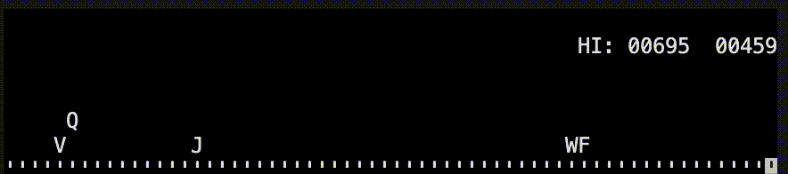
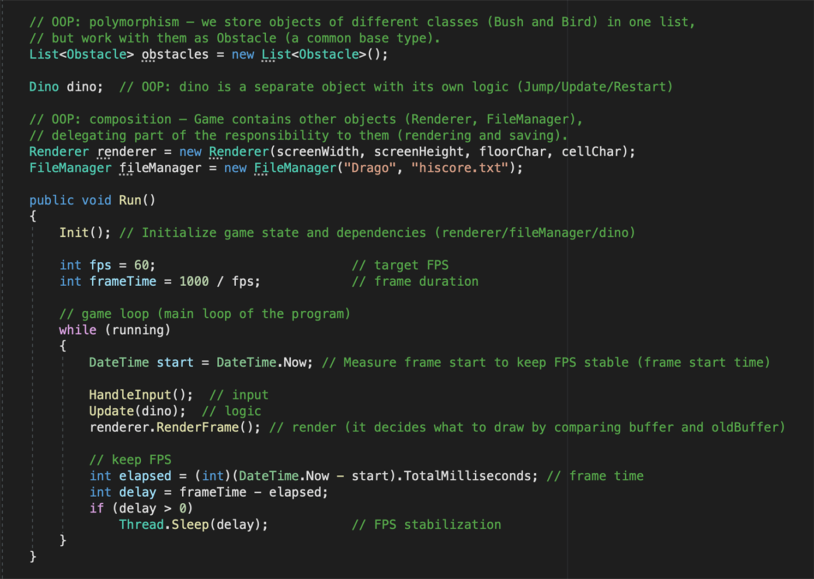

# Drago


A small educational C# console game demonstrating OOP basics and simple game architecture.

## Demo


## Code Example


**Purpose**
- Helps beginners understand **Object-Oriented Programming (OOP)** in practice  
- Demonstrates how a small game can be structured into clear responsibilities  
- Shows how multiple objects interact inside a real-time game loop  
- Introduces concepts such as collision detection, rendering, and game state management  
- Provides a simple foundation for further learning in game development  

**Game**
- The player controls a small dinosaur running across the screen
- Obstacles appear randomly and move from right to left
- The player must **jump** or **crouch** to avoid collisions
- The game gradually speeds up over time
- The best score is automatically saved to a file

**Controls**
- **Up Arrow** — jump  
- **Down Arrow** — crouch  
- **Space** — restart after Game Over  
- **Esc** — exit the game  

**Architecture**

The project is intentionally structured into small classes with clear responsibilities:

- **Game** — controls the main game loop and overall game logic  
- **Renderer** — handles console rendering using a double buffer  
- **Dino** — player entity with jump, crouch, and animation logic  
- **Obstacle** — base class for all obstacles  
- **Bird / Bush** — concrete obstacle implementations  
- **FileManager** — loads and saves the high score  
- **Rect** — simple structure used for collision detection  

This separation keeps the code readable and demonstrates how larger programs can be organized.

**OOP Concepts Demonstrated**
- Encapsulation
- Inheritance
- Polymorphism
- Abstraction
- Composition
- Message passing between objects

A short explanation of these concepts with references to the code can be found in **`Bonus_OOP.cs`**.

**Notes**
- Graphics are simple text characters rendered in the console  
- The focus is on **code structure and programming concepts**, not visual complexity  
- The project is intentionally small so beginners can read and understand the entire codebase  

---

## Requirements

### Windows
- Visual Studio 2022

### macOS
- Visual Studio for Mac 2019

---

## How to Run

### Windows
1. Open `Drago.sln` in **Visual Studio 2022**
2. Press **F5** to run

### macOS
1. Open `Drago_Mac/Drago.sln` in **Visual Studio for Mac 2019**
2. Press **Run**

---

### Visual Studio Code
This is an alternative way to run the project without Visual Studio.

Requires:
- Visual Studio Code
- .NET SDK

Run:

1. Open the project folder in **Visual Studio Code**
2. From the menu select **Terminal → New Terminal**
3. Run:

```
dotnet run
```

---

## Contact / Support

If you have questions, suggestions, or issues with the project, please use the **GitHub Discussions** page.

---

## Other

If you find this project useful, a ⭐ would mean a lot.